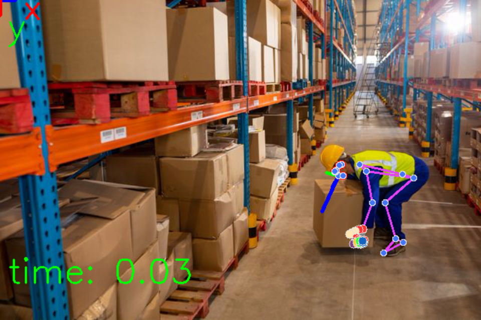
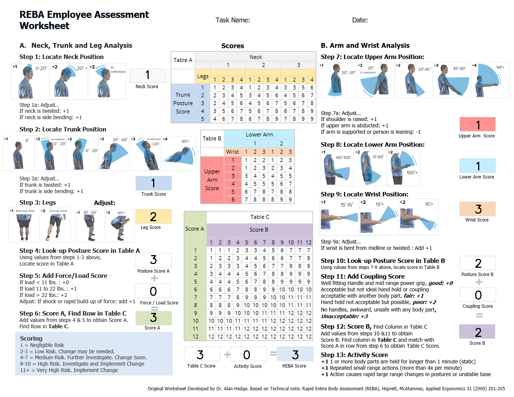
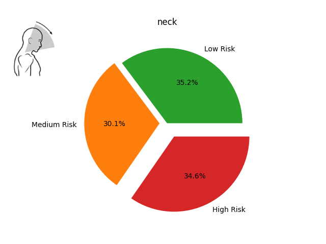
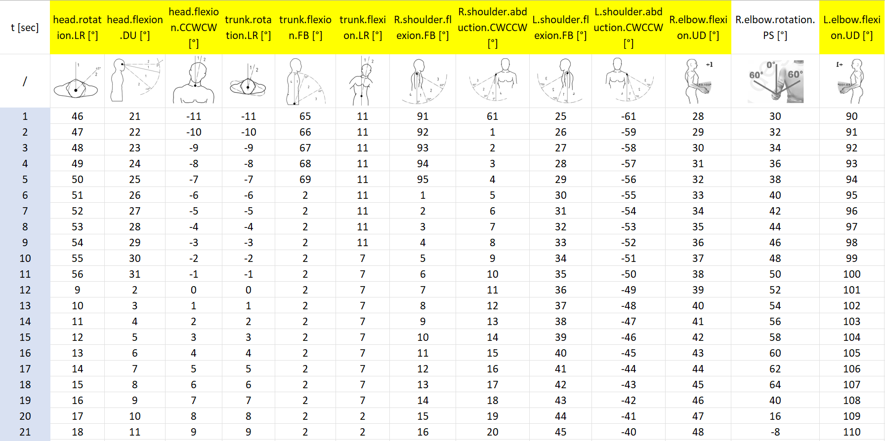

# SafeMove
SafeMove is an open-source project that aims to showcase how AI can be used to simplify ergonomic risk assessment through the REBA standard.

|Prediction|Analysis|
|---|---|
|||

## Dependencies:
The algorithm depends on [MediaPipe](https://github.com/google-ai-edge/mediapipe) a suite of AI tools to perform different visual tasks, such as human pose landmark estimation.

1. Install `pip`
    ```bash
    python -m ensure pip --default-pip
    ```
2. Install the following packages:
    ```bash
    pip install xlsxwriter pandas mediapipe opencv-python
    ```

## Usage:
Enter in the project directory and launch the following script:

```bash
python scripts/sm_01_main.py
```

## Results:
Enter in the folder `output` to visualize the results of your test.

You can visualize risk as body part graphs or as automatic generated excel containing the NN predictions over time.

|Body Parts|Excel|
|---|---|
|||

## Licence:

[](https://opensource.org/licenses/MIT)


